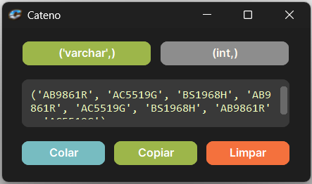
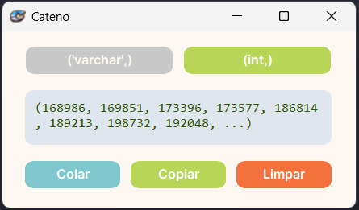

# Cateno 🗄️

O **Cateno** é um aplicativo desktop desenvolvido em Python com CustomTkinter para automatizar a formatação de listas de valores em consultas SQL.

## 📘 Sobre o projeto

O Cateno foi criado para resolver uma tarefa comum no dia a dia de quem trabalha com banco de dados: pegar uma lista de valores copiados e transformá-la rapidamente em uma estrutura pronta para uso em SQL, especialmente em cláusulas `IN`.

Em vez de formatar cada item manualmente, o aplicativo processa os dados automaticamente e entrega o resultado com mais rapidez, padronização e praticidade.


## 💡 Exemplo de Uso

**Entrada (Lista copiada pelo usuário):**
```text
    123
    456
    789
```

**Saída no modo ('varchar',):**
```text
('123', '456', '789')
```

**Saída no modo (int,):**
```text
(123, 456, 789)
```

## ✨ Funcionalidades

* Formatação automática de listas para SQL
* Modo varchar, com aspas simples em cada item
* Modo int, sem aspas
* Geração de preview resumido dos dados
* Botão para copiar o resultado final
* Botão para limpar o campo rapidamente
* Interface simples, leve e objetiva


## 🛠️ Tecnologias Utilizadas

* **Python 3**
* **CustomTkinter** (Para a interface gráfica)
* **Pyperclip** (Para manipulação da área de transferência)
* **Ctypes / Wintypes** (Para comunicação nativa com as APIs do Windows)
* **PyInstaller** (Para empacotamento do executável)


## 🎨 Temas Disponíveis

O aplicativo foi projetado com um visual limpo e moderno, e está disponível em duas versões para você escolher:

* **Cateno DM (Dark Mode)**



* **Cateno LM (Light Mode)**




## 🚀 Como baixar e usar (Versão Executável)

Se você não é desenvolvedor e quer apenas usar a ferramenta, disponibilizo duas pastas prontas: Cateno DM (Escuro) e Cateno LM (Claro).

1. Acesse a aba **Releases** no canto direito do GitHub.
2. Baixe o arquivo .zip da versão que você preferir (DM ou LM).
3. Extraia a pasta no seu computador (recomendável salvar na pasta Documentos).
4. Entre na pasta extraída, clique com o botão direito no arquivo `Cateno.exe` e escolha **Fixar na barra de tarefas** para ter acesso rápido sempre que precisar!

⚠️ **ATENÇÃO:** Nunca arraste o arquivo `Cateno.exe` para fora da sua pasta original! Ele precisa ficar sempre ao lado da pasta `_internal` para funcionar corretamente (ali está o "motor" do programa). 
Se quiser um ícone na sua Área de Trabalho, clique com o botão direito no `Cateno.exe`, escolha **"Criar atalho"** e mova apenas o atalho criado.

⚠️ **Aviso de Segurança do Windows:** Como este é um aplicativo independente e sem assinatura digital corporativa, o Windows (SmartScreen) exibirá uma tela azul dizendo *"O Windows protegeu o seu computador"* na primeira vez que você abri-lo. Isso é normal! Para prosseguir, clique em **"Mais informações"** e depois no botão **"Executar assim mesmo"**.


## 💻 Como rodar o código-fonte

Se você é desenvolvedor e quer rodar pelo terminal ou editar o código:

1. Clone o repositório:
   ```bash
   git clone https://github.com/lucasseib/cateno.git
   ```

2. Entre na pasta do projeto:
   ```bash
   cd cateno
   ```

3. Instale as dependências:
   ```bash
   pip install customtkinter pyperclip
   ```

4. Execute o aplicativo:
   ```bash
   python Cateno.py
   ```